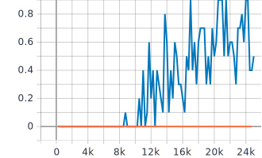
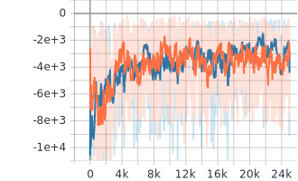
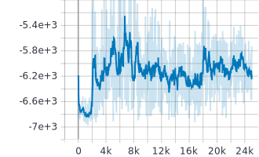
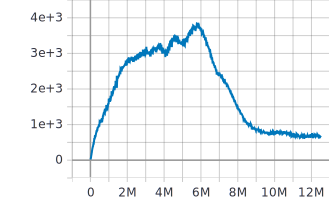
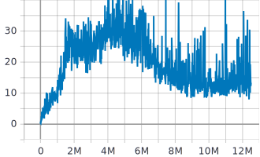
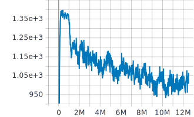
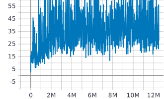
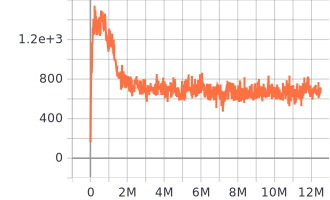
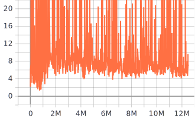

# Overview
An implementation of [Data-Efficient Hierarchical Reinforcement Learning](https://arxiv.org/pdf/1805.08296.pdf) (HIRO) in PyTorch.


# Installation
1. Follow installation of [OpenAI Gym Mujoco Installation](https://github.com/openai/mujoco-py)
```
1. Obtain a 30-day free trial on the MuJoCo website or free license if you are a student. The license key will arrive in an email with your username and password.
2. Download the MuJoCo version 2.0 binaries for Linux or OSX.
3. Unzip the downloaded mujoco200 directory into ~/.mujoco/mujoco200, and place your license key (the mjkey.txt file from your email) at ~/.mujoco/mjkey.txt.
```
2. Install Dependencies
```
pip install -r requirements.txt
```

# Run
For `HIRO`,
```
python main.py --train
```

For `TD3`,
```
python main.py --train --td3
```
# Evaluate Trained Model
Passing `--eval` argument will read the most updated model parameters and start playing. The goal is to get to the position (0, 16), which is top left corner.

For `HIRO`,
```
python main.py --eval
```

For `TD3`,
```
python main.py --eval --td3
```


# Trainining result
Blue is HIRO and orange is TD3

## Succss Rate


## Reward


## Intrinsic Reward


## Losses
Higher Controller Actor <br>


Higher Controller Critic<br>


Lower Controller Actor<br>


Lower Controller Critic<br>


TD3 Controller Actor<br>


TD3 Controller Critic<br>


